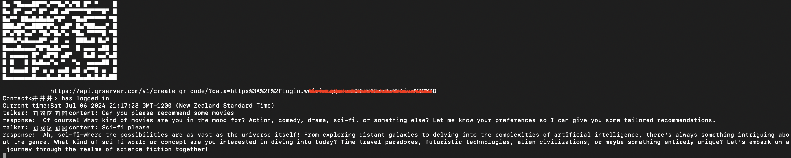
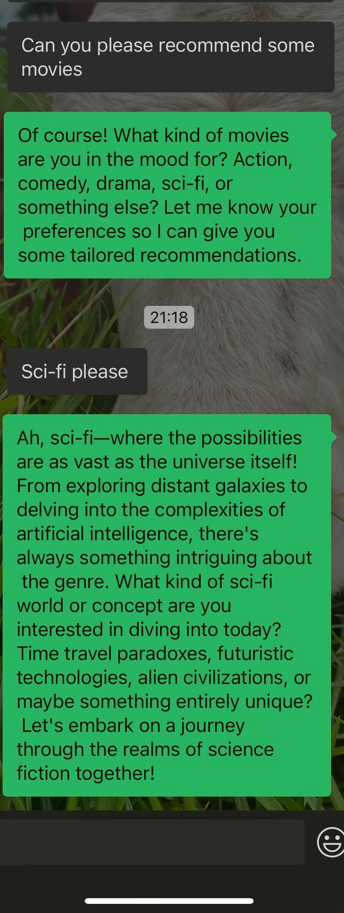

## Default Configuration

```javascript
{
  // Enter your OPENAI_API_KEY
  OPENAI_API_KEY: "",
  // Reverse proxy URL, simply put, your server address located abroad. See README for more details.
  reverseProxyUrl: "",
  // Keyword to activate the WeChat bot in group chats
  groupKey: "",
  // Keyword to activate the WeChat bot in private chats
  privateKey: "",
  // Keyword to reset the context, such as "reset"
  resetKey: "reset",
  // Whether to include the question in group chat replies
  groupReplyMode: true,
  // Whether to include the question in private chat replies
  privateReplyMode: false,
}
```

## Setting Up the Bot 🤖

1. First, follow the steps below to obtain your ChatGPT OPENAI_API_KEY.

> How to get your OPENAI_API_KEY:
>
> - Go to [https://platform.openai.com/overview](https://platform.openai.com/overview) and log in or sign up.


2. Enter the OPENAI_API_KEY in the `OPENAI_API_KEY` field in `src/config.ts`.

3. Enter the reverseProxyUrl in the `reverseProxyUrl` field in `src/config.ts`. For more details, see the instructions below.

> Alternatively, you can use the proxy address provided by Shanyue: `https://ai.devtool.tech/proxy/v1/chat/completions`. You can also follow [his project](https://github.com/shfshanyue/wechat-chatgpt).

4. Run the following commands in your terminal. If needed, configure other variables in `src/config.ts`.

```javascript
  // Install dependencies
  npm i
  npm run dev

  // Alternatively, using pnpm
  npm i -g pnpm
  pnpm i
  pnpm run dev
```

5. After running the commands, you will see output in the terminal. Scan the QR code to log in.
   

6. After successfully logging in, send a message to the logged-in WeChat from another WeChat account, and you will receive a reply from ChatGPT.
   

   
